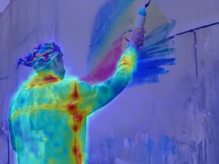
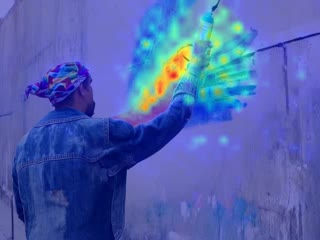
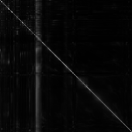

Here's the refined version of your README with clearer structure, improved wording, and consistent formatting:

---

# 🚀 Attention Map Visualization for Diffusers-Based Video Generation Models

This project extends the open-source [attention-map-diffusers](https://github.com/wooyeolBaek/attention-map-diffusers) and builds on ideas introduced in the paper *"DiTCtrl: Exploring Attention Control in Multi-Modal Diffusion Transformer for Tuning-Free Multi-Prompt Longer Video Generation"*. The goal is to visualize attention maps for video generation models based on the Diffusers framework, specifically focusing on **CogVideoX** models.

## 🌟 Key Features
- Visualizes attention maps for video generation tasks.
- Divides attention maps into three categories:
  - **Text-to-Text Attention Map**
  - **Text-to-Video Attention Map**
  - **Video-to-Video Attention Map**
- Supports **CogVideoX v1** model for text-to-video attention map visualization.

## 📦 Installation
1. Clone the repository:
   ```bash
   git clone https://github.com/your-username/your-project.git
   cd your-project
   ```
2. Install the required dependencies:
   ```bash
   pip install -r requirements.txt
   ```

## 🛠️ Usage
To run the project and visualize the attention maps, use the following script:

```python
import os
import torch
from diffusers import (
    CogVideoXPipeline,
    CogVideoXDPMScheduler
)
from attention_map_diffusers import (
    attn_maps,
    init_pipeline,
    save_vdm_attention_maps
)
from diffusers.utils import export_to_video

# Define paths and parameters
result_path = './results/cogvideox-t2v/'
os.makedirs(result_path, exist_ok=True)
model_path = "/maindata/data/shared/public/haobang.geng/haobang-huggingface/CogVideoX-2b"
guidance_scale = 6.0
seed = 43
output_path = os.path.join(result_path, 'output.mp4')

# Load the model
pipe = CogVideoXPipeline.from_pretrained(model_path, torch_dtype=torch.bfloat16)
pipe.scheduler = CogVideoXDPMScheduler.from_config(pipe.scheduler.config, timestep_spacing="trailing")
pipe.enable_sequential_cpu_offload()
pipe = init_pipeline(pipe)

# Define the prompt
prompt = "A street artist, clad in a worn-out denim jacket and a colorful bandana, stands before a vast concrete wall in the heart, holding a can of spray paint, spray-painting a colorful bird on a mottled wall."


# Generate video
video_generate = pipe(
    prompt=prompt,
    num_videos_per_prompt=1,
    num_inference_steps=50,
    num_frames=49,
    guidance_scale=guidance_scale,
    generator=torch.Generator().manual_seed(seed),
    height=480,
    width=720,
).frames[0]

# Save the generated video
export_to_video(video_generate, output_path)

# Save attention maps
attn_map_dir = os.path.join(result_path, 'attn_maps')
save_vdm_attention_maps(attn_maps, pipe.tokenizer, prompt, video_generate, output_dir=attn_map_dir, unconditional=True)
```

### ▶️ Command to Start
Run the script with the following command:
```bash
python visual-cogvideox-attention.py
```

---

## 📊 Results

Below are examples of attention maps generated by the **CogVideo5b** model.

### Prompt:
"A street artist, clad in a worn-out denim jacket and a colorful bandana, stands before a vast concrete wall in the heart of the city, holding a can of spray paint, spray-painting a colorful bird on a mottled wall."

#### Video:
[](./asserts/output.mp4)

### 🎥 Text-to-Video Attention Maps

The following videos represent the attention maps for specific words in the prompt, generated by the **CogVideo5b** model:

- **Word: "jacket"**
  [](./asserts/1.mp4)

- **Word: "paint"**
  [](./asserts/2.mp4)

- **Word: "bird"**
  [](./asserts/3.mp4)

- **Word: "wall"**
  [](./asserts/4.mp4)

### 🎥 Video-to-Video Attention Map


### 🎥 Text-to-Text Attention Map


### 🎥 All Attention Map


---

## 🙏 Acknowledgments
- This project is based on [attention-map-diffusers](https://github.com/wooyeolBaek/attention-map-diffusers).
- The ideas are inspired by the paper *DiTCtrl: Exploring Attention Control in Multi-Modal Diffusion Transformer for Tuning-Free Multi-Prompt Longer Video Generation*.

---

## 📝 TODO List

- **Current Support:**
  - CogVideoX v1 for text-to-video attention map visualization.

- **Future Work:**
  - [ ] Support for **CogVideoX v1.5** text-to-video attention map visualization.
  - [ ] Support for **Hunyuan** text-to-video attention map visualization.
  - [ ] Support for **CogVideoX** image-to-video attention map visualization.
  - [ ] Support for **Hunyuan** image-to-video attention map visualization.

---

## 🤝 Contributing
Contributions are welcome! Feel free to open issues or submit pull requests to improve the project.

## 📜 License
This project is licensed under the MIT License. See the [LICENSE](LICENSE) file for more details.

---

This version ensures the content is clear and easy to follow while keeping the format clean and professional. The key sections (installation, usage, results, etc.) are well-organized for better readability and understanding.